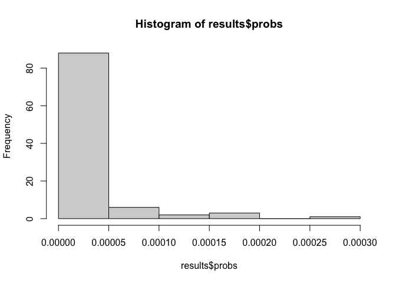

<!-- README.md is generated from README.Rmd. Please edit that file -->

# nnadic

<!-- badges: start -->

<!-- badges: end -->

The goal of nnadic (**N**eural **N**etwork for **A**symptotic
**D**ependence/**I**ndependence **C**lassification) is to classify
bivariate data sets as either asymptotically dependent or independent
using a trained convolutional neural network. The tool is set up to
automatically:  
- transform the marginal distribution  
- take the top 5% of the data (using the $l_\infty$-norm)  
- resample or subsample as necessary to ensure the data is of the
correct dimension  
- output the predicted result from the neural network

There are many customization options which allow the user to take
advantage of advanced functionality.

## Installation

You can install the development version of nnadic from
[GitHub](https://github.com/) with:

``` r
# install.packages("devtools")
devtools::install_github("twixson/nnadic")
```

Troubleshooting:

- The `nnadic` package requires the `nnadicTestData` package which has
  290Mb of data in it. Some users have found that they need to run
  `options(timeout = 400)` prior to installation.  
- The `nnadic` package requires a working `keras` installation. Some
  users have found that installing `keras` first is helpful. This
  includes ensuring that the python installation needed for the creation
  of the virtual environment is suitable.

Suggested install code:

``` r
install.packages("remotes", force = TRUE)
remotes::install_github("rstudio/tensorflow", force = TRUE)
remotes::install_github("rstudio/keras", force = TRUE)
reticulate::install_miniconda()
tensorflow::install_tensorflow()
reticulate::install_python(version = '3.9')
keras::install_keras()
options(timeout = 400)
install_github("twixson/nnadicTestData", force = TRUE)
install_github("twixson/nnadic")
```

## Example

This is a basic example which shows you the common workflow:

``` r
library(nnadic)
#> Welcome to nnadic!
library(nnadicTestData)
library(evd)      # for generating ADep datasets (logistic)
library(mvtnorm)  # for generating AInd datasets (gaussian)

test_data_four <- make_symmetric(test_data_four)

results <- nnadic(test_data_four, one_test = FALSE)
#> 125/125 - 1s - 503ms/epoch - 4ms/step
```


    #> [1] "Probabilities and predictions for each dataset are being returned"
    #> [1] "Each probability is the probability of AI which is coded as '1'"
    mean(results$preds == test_response_four)
    #> [1] 0.96925

``` r
set.seed(2938)
# Lets generate a new Adep dataset
data <- rbvevd(8734, dep = 0.5, model = "log")
# and test it
data_ready <- get_nnadic_input(data)
#> [1] "...transforming to exponential marginal distributions"
#> [1] "...   estimated gpd parameters in the marginal transformation were: "
#> [1] "...  ...location: 3.036   scale: 0.977   shape: 0.045"
#> [1] "...  ...location: 2.985   scale: 1.019   shape: 0.025"
#> [1] "...fewer than 10000 points detected, points above the 0.95 quantile"
#> [1] "...   will be resampled"
#> [1] "...   437 large points identified"
#> [1] "...the first 437 points in each dataset"
#> [1] "...   are the top 5% of points (repeated when possible)."
#> [1] "...the rest of the points were subsampled so that all 100"
#> [1] "...   datasets have 500 points."
#> [1] "...each dataset was made symmetric and now has 1000 points."
results <- nnadic(data_ready)
#> 4/4 - 0s - 61ms/epoch - 15ms/step
```



    #> [1] "Probabilities and predictions for each dataset are being returned"
    #> [1] "Each probability is the probability of AI which is coded as '1'"
    #> [1] "##################"
    #> [1] "The mean of the predictions is: 0"
    #> [1] "This is `nnadic`'s probability that these data are AI"
    results$mean
    #> [1] 0
    # should be 0

``` r
# Lets generate a new Adep dataset
data <- rmvnorm(19886, c(0,0), matrix(c(1, 0.5, 0.5, 1), nrow = 2))
# and test it
data_ready <- get_nnadic_input(data, subsample = TRUE)
#> [1] "...transforming to exponential marginal distributions"
#> [1] "...   estimated gpd parameters in the marginal transformation were: "
#> [1] "...  ...location: 1.655   scale: 0.48   shape: -0.126"
#> [1] "...  ...location: 1.672   scale: 0.47   shape: -0.121"
#> [1] "...more than 10000 points detected"
#> [1] "...\"subsample = TRUE\" including all points greater than the 0.95 quantile"
#> [1] "...   995 large points identified"
#> [1] "...points above the 0.95 quantile were subsampled 100 times"
#> [1] "...   so that each dataset has exactly 500 points."
#> [1] "...each dataset was made symmetric and now has 1000 points."
results <- nnadic(data_ready, make_hist = FALSE)
#> 4/4 - 0s - 20ms/epoch - 5ms/step
#> [1] "Probabilities and predictions for each dataset are being returned"
#> [1] "Each probability is the probability of AI which is coded as '1'"
#> [1] "##################"
#> [1] "The mean of the predictions is: 1"
#> [1] "This is `nnadic`'s probability that these data are AI"
results$mean
#> [1] 1
# should be 1
```
