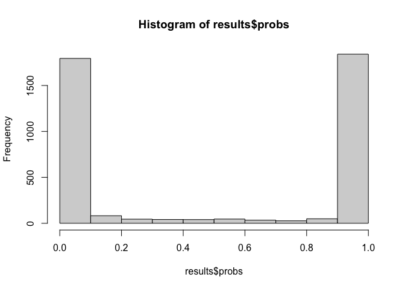

<!-- README.md is generated from README.Rmd. Please edit that file -->

# nnadic

<!-- badges: start -->
<!-- badges: end -->

The goal of nnadic (**N**eural **N**etwork for **A**symptotic
**D**ependence/**I**ndependence **C**lassification) is to classify
bivariate data sets as either asymptotically dependent or independent
using a trained convolutional neural network. The tool *will be* set up
to automatically:  
- transform the marginal distribution  
- take the top 5% of the data (using the $l_\infty$-norm)  
- resample or subsample as necessary to ensure the data is of the
correct dimension  
- output the predicted result from the neural network

There *will be* many customization options which allow the user to take
advantage of advanced functionality.

## Installation

You can install the development version of nnadic from
[GitHub](https://github.com/) with:

``` r
# install.packages("devtools")
devtools::install_github("twixson/nnadic")
```

Troubleshooting:

- The `nnadic` package requires the `nnadicTestData` package which has
  290Mb of data in it. Some users have found that they need to run
  `options(timeout = 400)` prior to installation.  
- The `nnadic` package requires a working `keras` installation. Some
  users have found that installing `keras` first is helpful.

Suggested install code:

``` r
Install.packages("remotes")
remotes::install_github("rstudio/tensorflow")
remotes::install_github("rstudio/keras")
reticulate::install_miniconda()
tensorflow::install_tensorflow()
keras::install_keras()
options(timeout = 400)
install_github("twixson/nnadicTestData")
install_github("twixson/nnadic")
```

## Example

This is a basic example which shows you the common workflow:

``` r
library(nnadic)
#> Welcome to nnadic!
library(nnadicTestData)
library(evd)      # for generating AD datasets (logistic)
library(mvtnorm)  # for generating AI datasets (gaussian)

results <- nnadic(test_data_four)
#> 125/125 - 2s - 2s/epoch - 17ms/step
mean(results$preds == test_response_four)
#> [1] 0.968
hist(results$probs, freq = F)
```



``` r

data <- rbvevd(10000, dep = 0.5, model = "log")
data_ready <- get_nnadic_input(data)
results <- nnadic(data_ready)
#> 4/4 - 0s - 348ms/epoch - 87ms/step
mean(results$preds) # should be 0
#> [1] 0

data <- rmvnorm(19834, c(0,0), matrix(c(1, 0.5, 0.5, 1), nrow = 2))
data_ready <- get_nnadic_input(data, subsample = TRUE)
results <- nnadic(data_ready)
#> 4/4 - 0s - 37ms/epoch - 9ms/step
mean(results$preds) # should be 1
#> [1] 0.99
```
